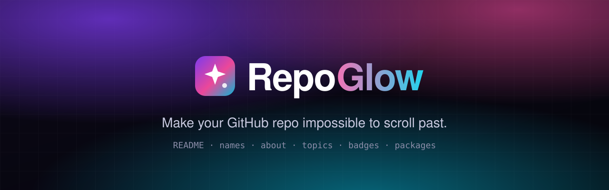
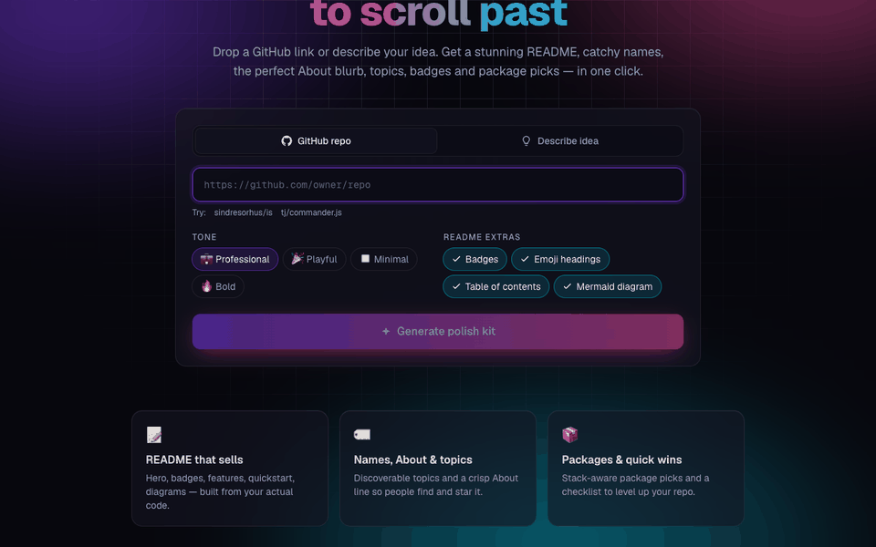
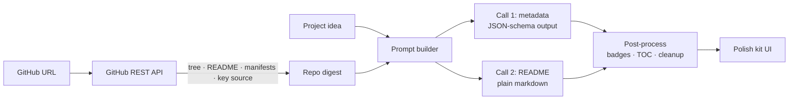

<div align="center">



<br />

**Turn any repo — or a one-line idea — into a polished, star-worthy GitHub project.**
AI-written README, catchy names, About blurb, topics, badges and package picks in one click —
running **100% locally** on [Ollama](https://ollama.com). No API keys, no cost, your code never leaves your machine.

<br />

[](https://nextjs.org)
[](https://www.typescriptlang.org)
[](https://tailwindcss.com)
[](https://ollama.com)
<br />
[](LICENSE)
[](CONTRIBUTING.md)

[**Quick start**](#-quick-start) · [**How it works**](#-how-it-works) · [**Report bug**](../../issues/new?template=bug_report.md) · [**Request feature**](../../issues/new?template=feature_request.md)

</div>

---

## ✨ Why RepoGlow?

Great code gets ignored when the repo looks like an afterthought. A blank README, no topics and a vague description mean nobody finds it — and those who do bounce in seconds.

RepoGlow reads your actual code (file tree, manifests, entry points, existing README) and hands back a complete **polish kit** grounded in what the project really does. No GitHub repo yet? Just describe the idea.

<div align="center">
  
  <br />
  <sub>Real run on <code>sindresorhus/is</code> with gpt-oss:20b on an M4 Pro — waiting time sped up.</sub>
</div>

## 🚀 Features

| | Feature | What you get |
|---|---|---|
| 📝 | **README generator** | Centered hero, badges, features, quick start with real commands from your manifests, usage, project structure, roadmap, contributing, license |
| 🏷️ | **Name ideas** | 5 memorable, kebab-case names with the reasoning behind each |
| 💬 | **About + tagline** | A crisp ≤350-char GitHub *About* description and a punchy one-liner |
| 🔎 | **Topics** | 8–20 searchable topics mixing language, framework, domain and use case |
| 🛡️ | **Badges** | Ready-to-paste shields.io badges for your stack |
| 📦 | **Package picks** | Stack-aware libraries for testing, DX and features — with install commands |
| ✅ | **Quick wins** | Prioritized checklist: license, CI, templates, social preview, releases… |
| 📊 | **Appeal score** | Before → after score so you know what moved the needle |
| ⚡ | **Live streaming** | Names, topics and packages appear first, then watch the README being written |
| 🚢 | **Ship to GitHub** | Edit the README, then open a pull request in one click (forks automatically if you can't push) and apply About & topics if you're an admin |
| 🔍 | **Fact-checked** | Badges, versions and package picks are verified against your real manifests — no suggesting Jest when you use node:test |
| 🎨 | **Tone & style** | Professional · Playful · Minimal · Bold, plus toggles for emoji, TOC and Mermaid diagrams |

Everything is one click to copy, the README downloads as `README.md`, and the preview renders HTML (centered heroes, collapsible sections) the same way GitHub does.

## 🧠 How it works



1. **Digest** — `src/lib/github.ts` pulls repo metadata, languages, file tree, existing README, manifests (`package.json`, `pyproject.toml`, `Cargo.toml`, `go.mod`, …) and a size-budgeted sample of entry-point source files.
2. **Generate** — `src/lib/llm.ts` makes two calls to your local Ollama model sharing one cached prompt prefix: names/about/topics/packages as schema-constrained JSON, then the README as plain markdown (local models write much better markdown outside a JSON string).
3. **Fact-check** — `src/lib/stack.ts` reads dependencies from `package.json`, `pyproject.toml`, `Cargo.toml`, `go.mod`, `Gemfile` and `composer.json`, detects existing tooling (test runner, linter, framework…), and drops package suggestions the project already has or that would replace it. Version badges are kept only if the manifests back them up.
4. **Post-process** — `src/lib/readme.ts` builds badges from real repo facts (npm/PyPI/crates name, license, CI workflow), generates a table of contents with GitHub anchors, and fixes common local-model mistakes (code-fenced READMEs, HTML in headings, invented badge paths, `<owner>` placeholders).
5. **Stream** — the API streams NDJSON events (stage → metadata → live README snapshots → done), so results show up as soon as each part is ready.
6. **Polish** — the UI renders the README preview, names, topics, badges, packages and checklist.

## ⚡ Quick start

### 🐳 With Docker (one command)

```bash
git clone https://github.com/nevil-codes/repoglow.git
cd repoglow
docker compose up
```

This starts RepoGlow plus a bundled Ollama and downloads the model on first run (~13 GB). Open [http://localhost:3000](http://localhost:3000).

| Your machine | Command |
|---|---|
| Linux + NVIDIA GPU | `docker compose -f docker-compose.yml -f docker-compose.gpu.yml up` |
| macOS | Docker can't use the Apple GPU, so run Ollama natively (`ollama pull gpt-oss:20b`) and start only the app: `docker compose -f docker-compose.yml -f docker-compose.mac.yml up app` |
| Anything else | `docker compose up` (CPU — works, but slow on a 20B model) |

Pass settings through the environment, e.g. `GITHUB_TOKEN=$(gh auth token) OLLAMA_MODEL=llama3.1:8b docker compose up`.

### 🛠️ From source

**Prerequisites:** Node.js 22+ and [Ollama](https://ollama.com) running locally.

```bash
ollama pull gpt-oss:20b   # or qwen3, llama3.1:8b, …
```

```bash
git clone https://github.com/nevil-codes/repoglow.git
cd repoglow
npm install
cp .env.example .env.local   # optional: change model / context size
npm run dev
```

Open [http://localhost:3000](http://localhost:3000) and paste a repo URL.

### Environment variables

| Variable | Required | Description |
|---|:---:|---|
| `OLLAMA_HOST` | — | Ollama server URL (default `http://127.0.0.1:11434`) |
| `OLLAMA_MODEL` | — | Model to use (default `gpt-oss:20b`) |
| `OLLAMA_NUM_CTX` | — | Context window in tokens (default `32768`). Lower it if you run out of memory |
| `OLLAMA_KEEP_ALIVE` | — | How long the model stays loaded after a request (default `30m`) |
| `GITHUB_TOKEN` | — | Raises the GitHub rate limit from 60 to 5,000 req/h, and enables **Ship to GitHub** (see below) |
| `REPOGLOW_ALLOW_REMOTE_WRITE` | — | Set to `true` to allow GitHub write actions when not on `localhost`. Leave unset unless you know you need it |

> [!TIP]
> Bigger models give noticeably better READMEs. `gpt-oss:20b` needs ~16 GB RAM; on smaller machines try `llama3.1:8b` and set `OLLAMA_NUM_CTX=16384`.

> [!NOTE]
> Hitting `GitHub rate limit` errors while testing? Add a `GITHUB_TOKEN` — unauthenticated requests are capped at 60/hour per IP.

### 🚢 Shipping to GitHub

With a token in `.env.local`, every repo result gets an **Open PR** button. RepoGlow commits the README (including your edits) to a new `repoglow/readme-…` branch and opens a pull request with the suggested About and topics in the description. If you can't push to the repo, it forks it to your account first. Repo admins also get **Apply About & topics**.

The quickest setup if you use the GitHub CLI:

```bash
echo "GITHUB_TOKEN=$(gh auth token)" >> .env.local
```

Or create a token yourself:

| Token type | Permissions needed |
|---|---|
| Classic | `public_repo` (or `repo` for private repos) |
| Fine-grained | Contents, Pull requests: read & write · Administration: read & write (only for *Apply About & topics*). Fine-grained tokens only work on repos you own |

> [!WARNING]
> The token acts as **you**. Write actions are only accepted from RepoGlow's own page (same-origin JSON requests) running on `localhost`, so other sites or other people on your network can't use it. Don't set `REPOGLOW_ALLOW_REMOTE_WRITE=true` on a deployment that others can reach.

## 🗂️ Project structure

```
src/
├── app/
│   ├── api/generate/route.ts   # Streaming POST endpoint: validate → digest → Ollama → NDJSON
│   ├── api/github/*/route.ts   # status · pr · about (token-backed GitHub actions)
│   ├── page.tsx                # Landing page + generator form
│   ├── layout.tsx              # Fonts, theme bootstrap, aurora background
│   └── globals.css             # Design tokens, glass + glow styles, markdown preview
├── components/
│   ├── Results.tsx             # Tabs: README · Names · About & Topics · Packages · Badges · Quick wins; editable README
│   ├── ShipPanel.tsx           # Open PR / apply About & topics
│   └── ui.tsx                  # Card, CopyButton, ThemeToggle, icons
└── lib/
    ├── github.ts               # Repo digest via GitHub REST API
    ├── prompt.ts               # Shared system prompt (+ example README), context, task prompts
    ├── llm.ts                  # Two-call Ollama pipeline, JSON-schema output, error mapping
    ├── readme.ts               # Badge builder, TOC generator, README cleanup
    ├── stack.ts                # Dependency parsing, tooling detection, package filtering
    ├── events.ts               # Streaming event types shared by API and UI
    ├── github-write.ts         # Branch, commit, fork, PR, About & topics
    ├── guard.ts                # Localhost + same-origin guard for write routes
    └── schema.ts               # Zod schemas for request + polish kit
```

## 🛠️ Tech stack

- **[Next.js 16](https://nextjs.org)** App Router + Route Handlers
- **[Ollama](https://ollama.com)** via [`ollama-js`](https://github.com/ollama/ollama-js) with JSON-schema structured outputs
- **[Zod](https://zod.dev)** for request validation and output schema
- **[Tailwind CSS 4](https://tailwindcss.com)** — dark-first glassmorphism UI with light mode
- **[react-markdown](https://github.com/remarkjs/react-markdown)** + `remark-gfm` for safe README preview

## 🗺️ Roadmap

- [x] README, names, About, topics, badges, packages, quick wins
- [x] Tone presets and README style toggles
- [x] Light / dark theme
- [x] Live streaming of results
- [x] Manifest-based fact checking for badges and packages
- [x] Open a PR with the README (token-based, auto-fork)
- [ ] Sign in with GitHub (OAuth) for multi-user deployments
- [ ] Private repo support
- [ ] Social preview image generator (1280×640)
- [x] Docker Compose setup (CPU, NVIDIA GPU, or native Ollama on macOS)
- [ ] One-click deploy to Vercel

## 🤝 Contributing

Contributions are welcome! Read [CONTRIBUTING.md](CONTRIBUTING.md), then open an issue or PR.

```bash
npm run lint && npx tsc --noEmit && npm test && npm run build
```

## 📄 License

[MIT](LICENSE) © Nevil Amraniya

<div align="center">
<br />

If RepoGlow made your repo shine, consider giving it a ⭐

</div>
