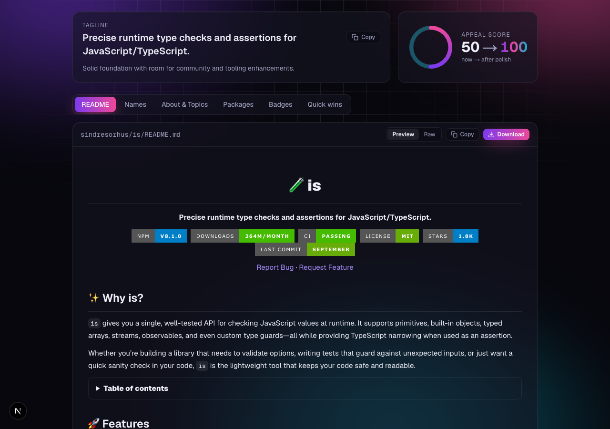
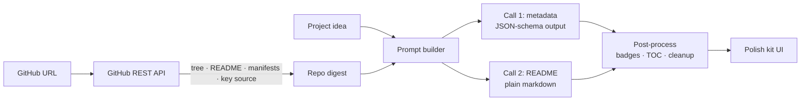

<div align="center">


<br />

**Turn any repo — or a one-line idea — into a polished, star-worthy GitHub project.**
AI-written README, catchy names, About blurb, topics, badges and package picks in one click —
running **100% locally** on [Ollama](https://ollama.com). No API keys, no cost, your code never leaves your machine.

<br />

[](https://nextjs.org)
[](https://www.typescriptlang.org)
[](https://tailwindcss.com)
[](https://ollama.com)
<br />
[](LICENSE)
[](CONTRIBUTING.md)

[**Quick start**](#-quick-start) · [**How it works**](#-how-it-works) · [**Report bug**](../../issues/new?template=bug_report.md) · [**Request feature**](../../issues/new?template=feature_request.md)

</div>

---

## ✨ Why RepoGlow?

Great code gets ignored when the repo looks like an afterthought. A blank README, no topics and a vague description mean nobody finds it — and those who do bounce in seconds.

RepoGlow reads your actual code (file tree, manifests, entry points, existing README) and hands back a complete **polish kit** grounded in what the project really does. No GitHub repo yet? Just describe the idea.

<div align="center">
  
</div>

## 🚀 Features

| | Feature | What you get |
|---|---|---|
| 📝 | **README generator** | Centered hero, badges, features, quick start with real commands from your manifests, usage, project structure, roadmap, contributing, license |
| 🏷️ | **Name ideas** | 5 memorable, kebab-case names with the reasoning behind each |
| 💬 | **About + tagline** | A crisp ≤350-char GitHub *About* description and a punchy one-liner |
| 🔎 | **Topics** | 8–20 searchable topics mixing language, framework, domain and use case |
| 🛡️ | **Badges** | Ready-to-paste shields.io badges for your stack |
| 📦 | **Package picks** | Stack-aware libraries for testing, DX and features — with install commands |
| ✅ | **Quick wins** | Prioritized checklist: license, CI, templates, social preview, releases… |
| 📊 | **Appeal score** | Before → after score so you know what moved the needle |
| 🎨 | **Tone & style** | Professional · Playful · Minimal · Bold, plus toggles for emoji, TOC and Mermaid diagrams |

Everything is one click to copy, and the README downloads as `README.md`.

## 🧠 How it works



1. **Digest** — `src/lib/github.ts` pulls repo metadata, languages, file tree, existing README, manifests (`package.json`, `pyproject.toml`, `Cargo.toml`, `go.mod`, …) and a size-budgeted sample of entry-point source files.
2. **Generate** — `src/lib/llm.ts` makes two calls to your local Ollama model sharing one cached prompt prefix: names/about/topics/packages as schema-constrained JSON, then the README as plain markdown (local models write much better markdown outside a JSON string).
3. **Post-process** — `src/lib/readme.ts` builds badges from real repo facts (npm/PyPI/crates name, license, CI workflow), generates a table of contents with GitHub anchors, and fixes common local-model mistakes (code-fenced READMEs, HTML in headings, invented badge paths, `<owner>` placeholders).
4. **Polish** — the UI renders the README preview, names, topics, badges, packages and checklist.

## ⚡ Quick start

**Prerequisites:** Node.js 20+ and [Ollama](https://ollama.com) running locally.

```bash
ollama pull gpt-oss:20b   # or qwen3, llama3.1:8b, …
```

```bash
git clone https://github.com/nevil-codes/repoglow.git
cd repoglow
npm install
cp .env.example .env.local   # optional: change model / context size
npm run dev
```

Open [http://localhost:3000](http://localhost:3000) and paste a repo URL.

### Environment variables

| Variable | Required | Description |
|---|:---:|---|
| `OLLAMA_HOST` | — | Ollama server URL (default `http://127.0.0.1:11434`) |
| `OLLAMA_MODEL` | — | Model to use (default `gpt-oss:20b`) |
| `OLLAMA_NUM_CTX` | — | Context window in tokens (default `32768`). Lower it if you run out of memory |
| `GITHUB_TOKEN` | — | Raises GitHub rate limit from 60 to 5,000 req/h. A fine-grained token with no extra scopes is enough |

> [!TIP]
> Bigger models give noticeably better READMEs. `gpt-oss:20b` needs ~16 GB RAM; on smaller machines try `llama3.1:8b` and set `OLLAMA_NUM_CTX=16384`.

> [!NOTE]
> Hitting `GitHub rate limit` errors while testing? Add a `GITHUB_TOKEN` — unauthenticated requests are capped at 60/hour per IP.

## 🗂️ Project structure

```
src/
├── app/
│   ├── api/generate/route.ts   # POST endpoint: validate → digest → Ollama
│   ├── page.tsx                # Landing page + generator form
│   ├── layout.tsx              # Fonts, theme bootstrap, aurora background
│   └── globals.css             # Design tokens, glass + glow styles, markdown preview
├── components/
│   ├── Results.tsx             # Tabs: README · Names · About & Topics · Packages · Badges · Quick wins
│   └── ui.tsx                  # Card, CopyButton, ThemeToggle, icons
└── lib/
    ├── github.ts               # Repo digest via GitHub REST API
    ├── prompt.ts               # Shared system prompt (+ example README), context, task prompts
    ├── llm.ts                  # Two-call Ollama pipeline, JSON-schema output, error mapping
    ├── readme.ts               # Badge builder, TOC generator, README cleanup
    └── schema.ts               # Zod schemas for request + polish kit
```

## 🛠️ Tech stack

- **[Next.js 16](https://nextjs.org)** App Router + Route Handlers
- **[Ollama](https://ollama.com)** via [`ollama-js`](https://github.com/ollama/ollama-js) with JSON-schema structured outputs
- **[Zod](https://zod.dev)** for request validation and output schema
- **[Tailwind CSS 4](https://tailwindcss.com)** — dark-first glassmorphism UI with light mode
- **[react-markdown](https://github.com/remarkjs/react-markdown)** + `remark-gfm` for safe README preview

## 🗺️ Roadmap

- [x] README, names, About, topics, badges, packages, quick wins
- [x] Tone presets and README style toggles
- [x] Light / dark theme
- [ ] Stream the README as it's written
- [ ] "Open PR with this README" via GitHub OAuth
- [ ] Private repo support
- [ ] Social preview image generator (1280×640)
- [ ] One-click deploy to Vercel

## 🤝 Contributing

Contributions are welcome! Read [CONTRIBUTING.md](CONTRIBUTING.md), then open an issue or PR.

```bash
npm run lint && npx tsc --noEmit && npm run build
```

## 📄 License

[MIT](LICENSE) © Nevil Amraniya

<div align="center">
<br />

If RepoGlow made your repo shine, consider giving it a ⭐

</div>
